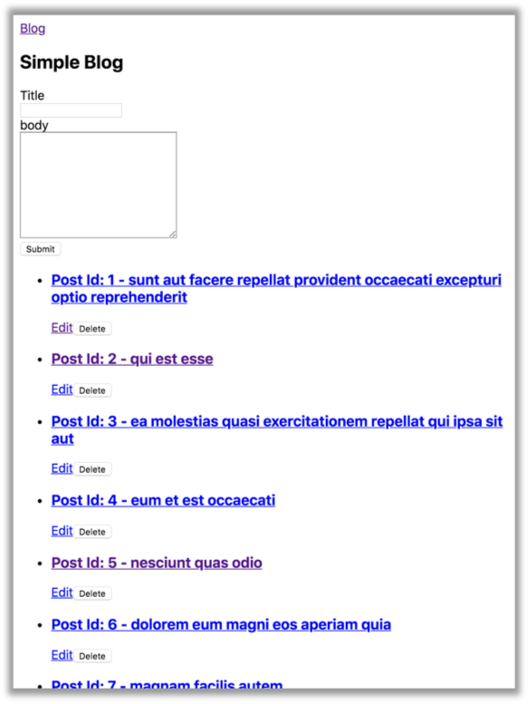

#### Mục tiêu

- Nắm bắt được về các thao tác với HttpClient trong Angular.

#### Mô tả

* Ứng dụng blog đơn giản

#### Hướng dẫn

##### Bước 1 - Chuẩn bị

Mở cửa sổ Terminal (hoặc Cmd trong Windows), di chuyển đến thư mục bạn muốn chứa project sau khi được tạo. Ví dụ, project sau khi được tạo sẽ lưu vào thư mục “projects” như sau:

```bash
$ cd projects
```

##### Bước 2 - Tạo dự án

Khởi tạo project “angular-blog” với Angular CLI như sau:

```bash
$ ng new angular-blog
```

Chấp nhận các lựa chọn mặc định bằng cách nhấn phím Enter. Angular CLI cài đặt các gói npm Angular cần thiết và các phụ thuộc khác. Quá trình này có thể mất vài phút.

Sau khi khởi tạo thành công project, bạn có thể mở project vừa tạo bằng IDE ưa thích (Ở đây chúng ta sử dụng Webstorm). Cấu trúc của project được tạo ra như sau:

<hình ảnh>

##### Bước 3 - Khởi tạo

Khởi tạo một service tên là post

```bash
$ ng generate service post
```

Khởi tạo các component sau: blog, blog-detail, blog-edit

```bash
$ ng generate component blog
$ ng generate component blog-detail
$ ng generate component blog-edit
```

Khởi tạo interface post

```bash
$ ng g interface post
```

##### Bước 4 - Bổ sung mã interface

Nội dung file post.ts:

```typescript
export interface IPost {
    userId: number;
    id: number;
    title: string;
    body: string;
}
```

##### Bước 5 - Cài đặt post service để gọi API

**post.service.ts**

```scss
import { HttpClient } from '@angular/common/http';
import { Injectable } from '@angular/core';
import { Observable } from 'rxjs';
import { map } from 'rxjs/operators';
import { IPost } from './post';

@Injectable({
    providedIn: 'root'
})
export class PostService {
    private readonly API_URL = 'http://jsonplaceholder.typicode.com/posts';
    constructor(private http: HttpClient) { }
  getPosts(count = 10): Observable<IPost[]> {
      return this.http.get<IPost[]>(this.API_URL).pipe(
          map(response => response.filter((post, i) => i < count))
      );
  }
  getPostById(id: number): Observable<IPost> {
      return this.http.get<IPost>(`${this.API_URL}/${id}`);
  }
  createPost(post: Partial<IPost>): Observable<IPost> {
      return this.http.post<IPost>(this.API_URL, post);
  }
  deletePost(id: number): Observable<any> {
      return this.http.delete(`${this.API_URL}/${id}`);
  }
  updatePost(post: IPost): Observable<IPost> {
      return this.http.patch<IPost>(`${this.API_URL}/${post.id}`, post);
  }
}
```

##### Bước 6 - Tạo mới file app-routing.module.ts

**app-routing.module.ts**

```typescript
import { NgModule } from '@angular/core';
import { RouterModule, Routes } from '@angular/router';
import { BlogComponent } from './blog/blog.component';
import { BlogDetailComponent } from './blog-detail/blog-detail.component';
import { BlogEditComponent } from './blog-edit/blog-edit.component';

const routes: Routes = [{
    path: 'blog',
    component: BlogComponent
}, {
    path: 'blog/:id',
    component: BlogDetailComponent
}, {
    path: 'blog/:id/edit',
    component: BlogEditComponent
}];

@NgModule({
    imports: [RouterModule.forRoot(routes)],
    exports: [RouterModule]
})
export class AppRoutingModule {}
```

##### Bước 7 - Code phần logic cho component

**blog.component.ts**

```typescript
import { Component, OnInit } from '@angular/core';
import { PostService } from '../post.service';
import { IPost } from '../post';
import { FormBuilder, FormGroup, Validators } from '@angular/forms';

@Component({
    selector: 'app-blog',
    templateUrl: './blog.component.html',
    styleUrls: ['./blog.component.scss']
})
export class BlogComponent implements OnInit {
    postList: IPost[] = [];
    postForm: FormGroup;
    constructor(
        private postService: PostService,
    private fb: FormBuilder
) {}

  ngOnInit() {
      this.postForm = this.fb.group({
          title: ['', [Validators.required, Validators.minLength(10)]],
          body: ['', [Validators.required, Validators.minLength(10)]],
      });
      this.postService
          .getPosts()
          .subscribe(next => (this.postList = next), error => (this.postList = []));
  }

  onSubmit() {
      if (this.postForm.valid) {
          const {value} = this.postForm;
          this.postService.createPost(value)
              .subscribe(next => {
                  this.postList.unshift(next);
                  this.postForm.reset({
                      title: '',
                      body: ''
                  });
              }, error => console.log(error));
      }
  }

  deletePost(i) {
      const post = this.postList[i];
      this.postService.deletePost(post.id).subscribe(() => {
          this.postList = this.postList.filter(t => t.id !== post.id);
      });
  }
}

```

**blog-detail.component.ts**

```typescript
import { Component, OnInit } from '@angular/core';
import { ActivatedRoute } from '@angular/router';
import { PostService } from '../post.service';
import { IPost } from '../post';

@Component({
    selector: 'app-blog-detail',
    templateUrl: './blog-detail.component.html',
    styleUrls: ['./blog-detail.component.scss']
})
export class BlogDetailComponent implements OnInit {
    post: IPost;
    constructor(
        private route: ActivatedRoute,
    private postService: PostService
) {}

  ngOnInit() {
      const id = +this.route.snapshot.paramMap.get('id');
      this.postService.getPostById(id).subscribe(
          next => (this.post = next),
          error => {
              console.log(error);
              this.post = null;
          }
      );
  }
}
```

**blog-edit.component.ts:**

```typescript
import { Component, OnInit } from '@angular/core';
import { FormGroup, FormBuilder, Validators } from '@angular/forms';
import { ActivatedRoute, Router } from '@angular/router';
import { IPost } from '../post';
import { PostService } from '../post.service';

@Component({
    selector: 'app-blog-edit',
    templateUrl: './blog-edit.component.html',
    styleUrls: ['./blog-edit.component.scss']
})
export class BlogEditComponent implements OnInit {
    post: IPost;
    postForm: FormGroup;
    constructor(
        private route: ActivatedRoute,
    private postService: PostService,
    private fb: FormBuilder,
    private router: Router
) {}

  ngOnInit() {
      this.postForm = this.fb.group({
          title: ['', [Validators.required, Validators.minLength(10)]],
          body: ['', [Validators.required, Validators.minLength(10)]]
      });
      const id = +this.route.snapshot.paramMap.get('id');
      this.postService.getPostById(id).subscribe(
          next => {
              this.post = next;
              this.postForm.patchValue(this.post);
          },
          error => {
              console.log(error);
              this.post = null;
          }
      );
  }

  onSubmit() {
      if (this.postForm.valid) {
          const { value } = this.postForm;
          const data = {
              ...this.post,
              ...value
          };
          this.postService.updatePost(data).subscribe(
              next => {
                  this.router.navigate(['/blog']);
              },
              error => console.log(error)
          );
      }
  }
}
```

##### Bước 8 - Cập nhật template

Thay phần template của component vừa tạo bằng đoạn code sau:

**file blog.component.html:**

```html
<h2>Simple Blog</h2>

<form [formGroup]="postForm" (ngSubmit)="onSubmit()">
    <div>
        <label>
            Title
            <br>
            <input type="text" formControlName="title">
        </label>
    </div>
    <div *ngIf="postForm.get('title').invalid && postForm.get('title').touched" style="color: red">
        Title is required and min length is 10
    </div>
    <div>
        <label>
            body
            <br>
            <textarea formControlName="body" cols="30" rows="10"></textarea>
        </label>
    </div>
    <div *ngIf="postForm.get('body').invalid && postForm.get('body').touched" style="color: red">
        Body is required and min length is 10
    </div>
    <button type="submit">Submit</button>
</form>

<ul>
    <li *ngFor="let post of postList; index as i">
        <h3>
            <a [routerLink]="['/blog', post.id]">
                Post Id: {{post.id}} - {{post.title}}
            </a>
        </h3>
        <a [routerLink]="['/blog', post.id, 'edit']">Edit</a>

        <button (click)="deletePost(i)">Delete</button>
    </li>
</ul>
```

blog-detail.component.html

```html
<div *ngIf="post; else nothing">
    <h4>
        {{post.title}}
    </h4>
    <p>
        {{post.body}}
    </p>
</div>

<ng-template #nothing>
    <p>Nothing to show</p>
</ng-template>
```

blog-edit.component.html:

```html
<form [formGroup]="postForm" (ngSubmit)="onSubmit()">
    <div>
        <label>
            Title
            <br>
            <input type="text" formControlName="title">
        </label>
    </div>
    <div *ngIf="postForm.get('title').invalid && postForm.get('title').touched" style="color: red">
        Title is required and min length is 10
    </div>
    <div>
        <label>
            body
            <br>
            <textarea formControlName="body" cols="30" rows="10"></textarea>
        </label>
    </div>
    <div *ngIf="postForm.get('body').invalid && postForm.get('body').touched" style="color: red">
        Body is required and min length is 10
    </div>
    <button type="submit">Submit</button>
</form>
```

##### Bước 9 - Bổ sung app.module.ts

app.module.ts

```typescript
import { HttpClientModule } from '@angular/common/http';
import { NgModule } from '@angular/core';
import { ReactiveFormsModule } from '@angular/forms';
import { BrowserModule } from '@angular/platform-browser';
import { AppRoutingModule } from './app-routing.module';
import { AppComponent } from './app.component';
import { BlogDetailComponent } from './blog-detail/blog-detail.component';
import { BlogComponent } from './blog/blog.component';
import { BlogEditComponent } from './blog-edit/blog-edit.component';

@NgModule({
    declarations: [
        AppComponent,
        BlogComponent,
        BlogDetailComponent,
        BlogEditComponent
    ],
    imports: [
        BrowserModule,
        ReactiveFormsModule,
        HttpClientModule,
        AppRoutingModule
    ],
    bootstrap: [AppComponent]
})
export class AppModule { }
```

##### Bước 10 - Thêm vào app.component.html

app.component.html

```html
<nav>
    <a routerLink="/blog">Blog</a>
</nav>
<router-outlet></router-outlet>
```

##### Bước 11 - Chạy dự án

Chạy dự án với lệnh sau

```bash
$ ng serve -o
```

Kiểm tra kết quả hiển thị trên trình duyệt [localhost:4200/blog](localhost:4200/blog)

Người dùng có thể click chuyển trang qua lại, có thể:

* tạo mới post
* cập nhật post
* xóa post.

Kết quả hiển thị trên trình duyệt như hình ảnh:



Mã nguồn tham khảo: <link-mã-nguồn>